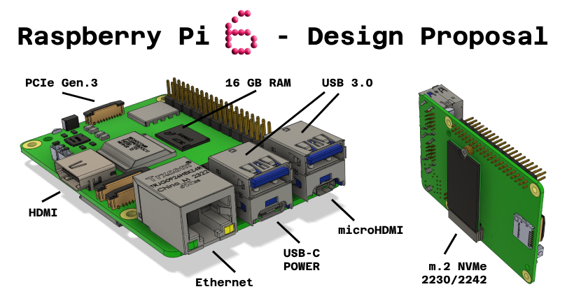
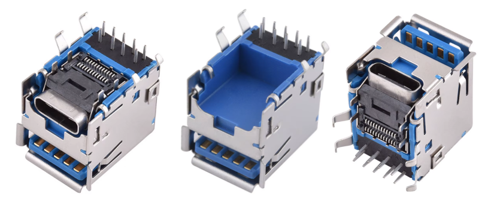
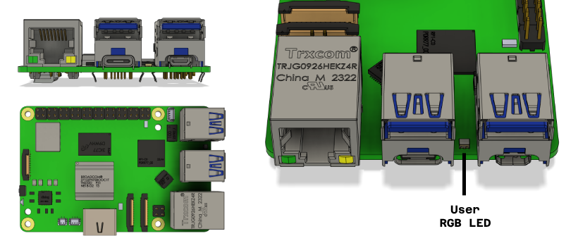

# My Vision for the Raspberry Pi 6

I am excited to share my vision for the new Raspberry Pi 6 — a device that not only better meets professional requirements but also becomes an even more versatile tool for makers and hobbyists alike. I believe the changes I'm proposing will make the Raspberry Pi more competitive in the single-board computer market and open up a range of new possibilities for users—allowing for the creation of innovative, creative projects that are more useful and offer a better user experience.

My vision doesn't focus on aspects like the processor or other core components but rather on the optimal placement and functionality of connectors. These changes would make the Raspberry Pi even more useful and compatible with various applications. Importantly, these modifications do not require altering basic parameters such as the PCB dimensions, the location of the 40-pin GPIO connector, or the mounting holes, thus maintaining maximum compatibility with existing solutions.

## Connector Placement

One of the most significant changes that could simplify working with the Raspberry Pi 6 is placing the most important connectors on one side of the board—the front. Currently, the power and micro HDMI are on the side, while Ethernet and USB ports are at the front. The power button and status LED are at the back, creating an inconvenient layout.

On the front side, the connectors would be:

- **Ethernet RJ45**: On the left side, as it is now.
- **USB-C**: Replacing the lower/middle USB-A 3.0 port—serving as the power supply for the Raspberry Pi 6 and for communication, if technically possible.
- **USB-A 3.0**: Above the USB-C, as it currently is.
- **Micro HDMI**: On the right side at the bottom, replacing the USB-A 2.0 port.
- **USB-A 3.0**: On the right side at the top, replacing the USB-A 2.0 port.

This configuration is made possible by using connectors like [these right-angle USB ports](https://www.aliexpress.com/item/1005004922477359.html).

### Advantages of the New Configuration

This setup allows you to connect the following peripherals using only the front side of the device:

- USB-C power,
- LAN network,
- LCD monitor,
- USB peripherals.

All connectors are located on one side of the device—the front. This is a significant convenience when designing enclosures, building clusters in a 19” rack, mounting the Raspberry Pi inside larger devices, and it also improves aesthetics.

One micro HDMI connector would remain on the side, as it is currently. If reduced to a single micro HDMI, it would be worth considering replacing it with a standard HDMI port, making it easier to use without adapters.

## Ethernet

A 1 Gbit Ethernet port is adequate, but if a 2.5 Gbit port can be used, the Raspberry Pi would gain an edge over the competition.

## User LED

In professional applications, there's often a need for a built-in LED that can be controlled programmatically. When working without a monitor and keyboard, such an LED could signal, for example, the completion of an installation. Ideally, it would be an RGB LED controlled from pins other than the 40-pin GPIO, preferably using hardware PWM.

The LED could be located on the front between the connectors or on the back of the PCB under the connectors.

The existing power/status LED (green/red) that indicates the device's state should remain unchanged to maintain compatibility.

## M.2 NVMe Slot

In the Raspberry Pi 6, an M.2 NVMe slot should be standard. It should be located on the underside of the PCB and support 2230 and 2242 size drives. At least one PCIe Gen 3 lane, ideally two PCIe Gen 3 lanes or one PCIe Gen 4 lane.

It would be best to have mounting holes for both 2230 and 2242 sizes. However, it's acceptable to provide mounting only for 2242, as a 3D-printed adapter can be used to mount a 2230 drive to a 2242 slot, like this one: [M.2 SSD 2230 to 2242 Adapter](https://www.printables.com/model/578236-m2-ssd-2230-to-2242).

## PCIe

The PCIe connector in the Raspberry Pi 5 is one of its greatest advantages and should remain unchanged. If the new processor offers more PCIe lanes, one could be dedicated to the M.2 slot and another to the ribbon cable PCIe connector.

## Boot Options

It would be valuable to introduce the ability to set the boot order using a keyboard, like in a standard BIOS. Currently, changing the boot order requires additional steps, which can be inconvenient when deploying multiple devices. Alternatively, the Raspberry Pi could automatically attempt to boot from various media in a predefined sequence.

## RAM

A 16 GB RAM option in the Raspberry Pi 6 is, in my opinion, crucial for professional applications. The current limitation to 8 GB RAM can be an obstacle for broader usage.

## CPU

The processor in the Raspberry Pi 5 is decent, but I would expect higher single-core performance in the Raspberry Pi 6. Ideally, the new processor would have 8 cores, or at least 6 cores to align with the name. Moving to a smaller manufacturing process than the current 16 nm would allow for lower energy consumption. For example, the Intel N100 is manufactured using a 10 nm process.

## Raspberry Pi Imager

The Raspberry Pi Imager should enable direct image burning onto an NVMe drive and offer more settings, at least for Raspberry Pi OS and Ubuntu.

## Other Considerations

- **Fan Connector**: Retained as in the Raspberry Pi 5.
- **Standard Active Cooler**: The standard, original active cooler from the Raspberry Pi 5 is great, and I would use the same one in the Raspberry Pi 6.
- **QWIIC Connector**: To be considered, it would allow easy connection of accessories.
- **Beeper/Buzzer**: A cost-effective way to provide an additional means of communication with the user.
- **Camera and RTC Connectors**: No changes needed.
- **Power Button Connector**: Allowing it to be extended to the enclosure panel, as in the Raspberry Pi 5.
- **MicroSD Card Slot**: Retained for compatibility.
- **PoE**: No changes needed.
- **QR Code on PCB**: Containing a unique CPU ID, LAN MAC, and WiFi MAC, placed on the underside of the device.
- **Test Pads on the Underside**: For everything that might be useful.
- **Support for Faster MicroSD Cards**: Faster cards are now available that could speed up the device's operation.

## Conclusion

My vision for the Raspberry Pi 6 focuses on enhancing functionality through better connector placement, adding more RAM, improving boot options, and introducing features that support professional applications. I am convinced that these changes will make the Raspberry Pi 6 an even more universal and competitive tool.

## Contribution

If anyone would like to submit their own ideas for improving the Raspberry Pi, please feel free to open an issue and describe your suggestion as precisely as possible. This repository represents my thoughts and serves as an invitation for further discussion. Let's let the community know what we expect from the successor to the Raspberry Pi 5.

You can also start a discussion in the [Discussions](https://github.com/cmd0s/Raspberry-Pi-6-Design-Proposal/discussions) tab on GitHub.

I am also sharing the 3D models I used so that the community can easily edit them and showcase their own ideas. I created the visualizations in Fusion 360.